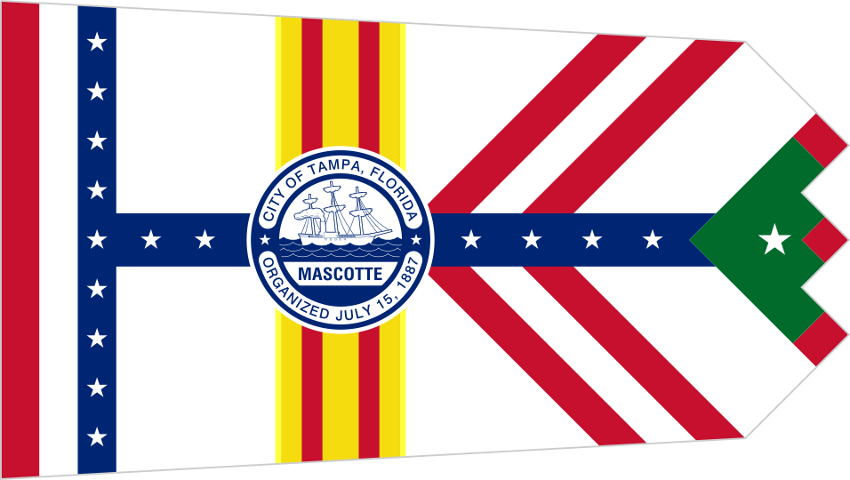

# Tampa Census

---

## Assignment for HIS4936, [Hacking History](http://hacking-history.readthedocs.io)

---

---

## The Proposal

### Introduction
 
The state of Florida, particularly Tampa, are experiencing an extreme lack of medical personel. A major factor in this predicament stems from a polarization in worker availabilty due to access to education. A treding issue in todays workforce, lack of education is creating a large manual labor employee pool. While analytical positions are behind an edcuation barrier, creating a much smaller pool of employees. By accessing the census data for Tampa, Florida we fully expect to see a correlation between acheived degrees and household income. Due to the extreme need for Nursing personell in the state of Florida we fully expect to see a large ammount education tracking into medical proffesions.

---

### Workflow

1. Accessing Tampa, Florida census records that are readily avaialble for download.
	* https://datausa.io/profile/geo/tampa-fl/
2. Sourcing articles and documents for understadning the issue.
3. Applying data sets in Tableau for visualization of data sets.
4. Processing comparison graphs to better visualize data sets.

---

### Scholarship

Here is where you should expand a bit on any relevant scholarship, whether
digital or historical. If you refer to authors in your bibliography, you need
only use parenthetical (author, year) notation. If you are referring to a web
resource, you can always link directly to it.

This section should not be a large histiographical essay going on about the
merits or drawbacks of different individuals. That kind of discussion can go
in your final project. Instead, this should be a place to let your reader know
in the space of several paragraphs the basic schools of thought or important
works of scholarship that relate to your project. More importantly, you can
suggest what (potentially) a digital project such as the one you are proposing
could say to such a debate.

Remember that you can and should talk about both digital and historical
scholarship, when relevant. [Digital Humanities Quarterly](www.digitalhumanities.org/dhq/)
is a good starting point.

Rather than think of this as a discussion about others, it might be more
helpful to think of it like this: in academia there are lots of scattered, but
important conversations going on, you can have more impact when you can connect
what you are saying to more and more of these conversations. So, you can think
of it like selling your project by linking it to its possible links to others.

---
