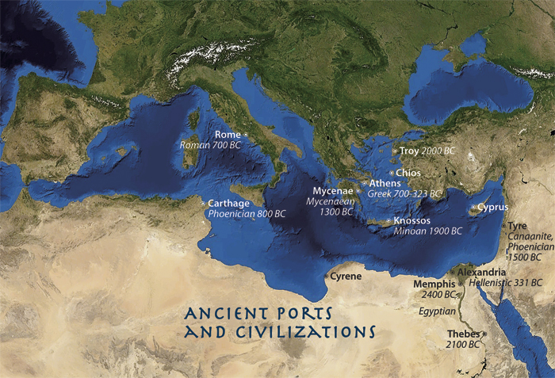

# Trade in the Ancient Mediterranean

---

## Assignment for HIS4936, [Hacking History](http://hacking-history.readthedocs.io)

---

---

## The Proposal

---

### Introduction

Our research topic is trade in the ancient Mediterranean. The dataset we will be using shows, for most ships at least, where the ships origin and the ships destination as well as the ships cargo. This valuable information can help us explore many questions about trade in the ancient world. 

The questions we aim to answer with or data visualization project are as follows:
* Who was the central hub of trade in the ancient Mediterranean.
* What goods/services were the most commonly traded.
* With visualization of the wrecks, can we find the trade routes used?

The database covers all ancient shipwrecks known currently up to 1500 AD. The database contains a little over 600 entries with a vast variety of different cultures represented. The database focuses on 5 main categories of cargo.
* Amphoras, Marble, Columns, Blocks and Sarcophagus. 

---

### Workflow

Our data source is a Database of Ancient Shipwrecks supplied by the Oxford Roman Economy Project. The website offers a(n) original frozen version of the database which can be downloaded as an excel spreadsheet. This makes the project extremely convenient to organize and visualize. The following steps will be used to complete our project.
* Download the frozen dataset from the website
* Use OpenRefine to clean the data as the database has some outlier entries when it comes to destination points and origin points such as extra spaces, unnecessary punctuations such as question marks and periods. OpenRefine will allow us to clean the excel spreadsheet to get cleaner and more streamlined information.
* Lastly, import our spreadsheet and visualize the information on tableau to attempt to answer the questions we have set out for our project.

---

### Group Members
* Corey Dewey
	* I will handle all the technical aspects of the project such as GitHub, Tableau, OpenRefine ect. Gathering the information and preparing the information for my team member to use
	* Once Laura has an idea of how she would like to visualize our project I will then work with her in Tableau to get her ideas into a visual form
	* Group Leader
	
* Laura Monge
	* Creative Director of the project. She will be in charge of putting the data into an informative, concise and creative manner.
	* Once she has a visual direction for the project, will deliver her ideas to the project leader.

* This is the optimal setup for our group as Corey is very tech savvy but lacks creativity where Laura can assist in putting our data into an informative visual form.
---

