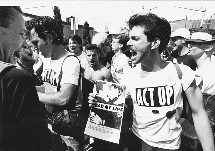

# **ACTUP Oral Histories Analysis**

---

## Assignment for HIS4936, [Hacking History](http://hacking-history.readthedocs.io)

---

#### *By Catherine Cueto and Kelly Teel*

---

---

## The Proposal

### Introduction

The intention of our (Kelly and Catherine) project is to gather information on the AIDS Coalition to Unleash Power (ACT UP). We hope to engage with oral histories from ACT UP’s oral history archive to discern why an organization would exist, what they have accomplished, what types of resistance they encountered, and locations of resistance and oppression. We also hope to capture lived experience and the individual identities of ACT UP’s members and founders. One of the Founders of ACT UP, Larry Kramer has authored essays and books that thoroughly engage with this topic. In conjunction to analyzing the data from ACT UP, we will engage with the writings of Kramer, in the hopes of providing a cohesive project that captures the essence of ACT UP’s earliest activism. 

The history of ACT UP is very much so a product of the modern era, the organization’s archive would not have existed decades before due to the fact that AIDS is a relatively modern disease and AIDS and homosexuality have often been deemed taboo and marginalized topics. The existence of such an archive demonstrates that there is an imperative to provide LGBTQI histories from the bottom up. We seek to develop the historical precedent set by ACT UP and scholars of LGBTQI history to offer pertinent awareness of AIDS’ influence on people that have historically maintained a marginalized locus within American society. We will be approaching this topic with an intersectional analysis, rather than offering blanket generalizations, we hope to put forward a digital project that captures nuances that are obscured when humanists fail to consider the influence of power relationships on the lives and lived experiences of individuals.  

---

### Workflow

We hope to successfully scrape data from [ACTUP Oral History Project](actuporalhistory.org) using Google’s Web Scrape feature. If we are able to successfully achieve this mission, we intend to utilize Tableau and perhaps Orange Three. Tableau could be used to map geographic locations of resistance or oppression, and Orange Three to provide a linguistic analysis of the data. 

Catherine will be working as the project manager and the data scientist, Kelly will be handling the visualizations and source analysis. Although we have decided that these specific tasks will be the responsibility of particular group members, this is not an absolute and we intend to accomplish all tasks as a team, sharing responsibility and mutually supporting one another. We will both handle the writeups on methodology, data, visualizations and the conclusion. As we approach this topic, we intend to consider geographic location, age, race, gender identity, biological sex, and class. We understand that history and events do not occur in a vacuum, therefore we shall consider the zeitgeists of the 80s and 90s as we engage with identity politics. It is our hope to provide meaning and tell a valuable story of resistance through data.

---

### Scholarship

Unfortunately, there is a lacking in proper digital humanities projects within the field of LGBT histories. However, there are sources
and applications available to start these various projects. There are several small collections of oral histories, databases of art by
LGBT creators, and countless texts on the topic that can be analyzed to uncover further meaning in how LGBT history is covered in the
academic community.

However, websites such as [The LGBT Oral History Digital Collaboratory](http://lgbtqdigitalcollaboratory.org/) are prime examples of the growth among the LGBT Histories
community. Showing that through the collection of oral histories and their transcripts, historians and activists are unknowingly
beginning to contribute to the digital future of historical research.

---
